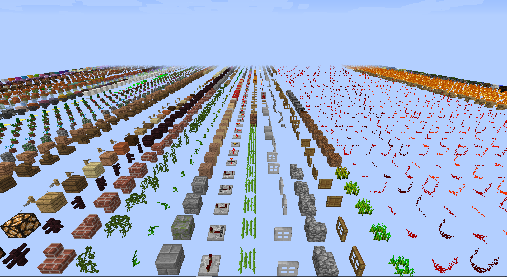
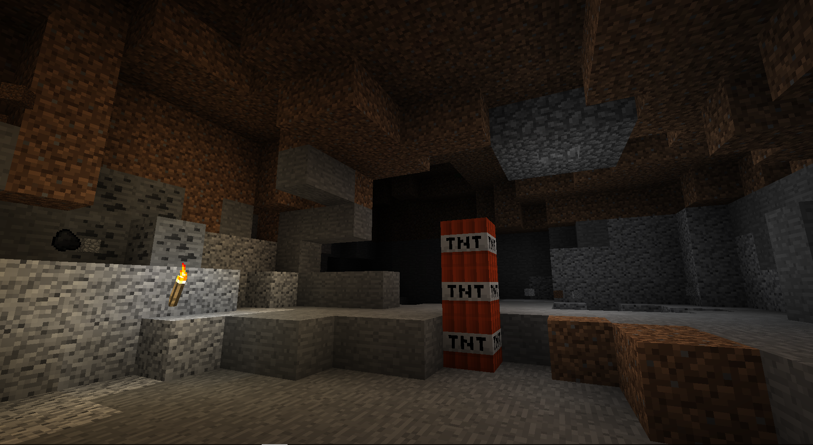
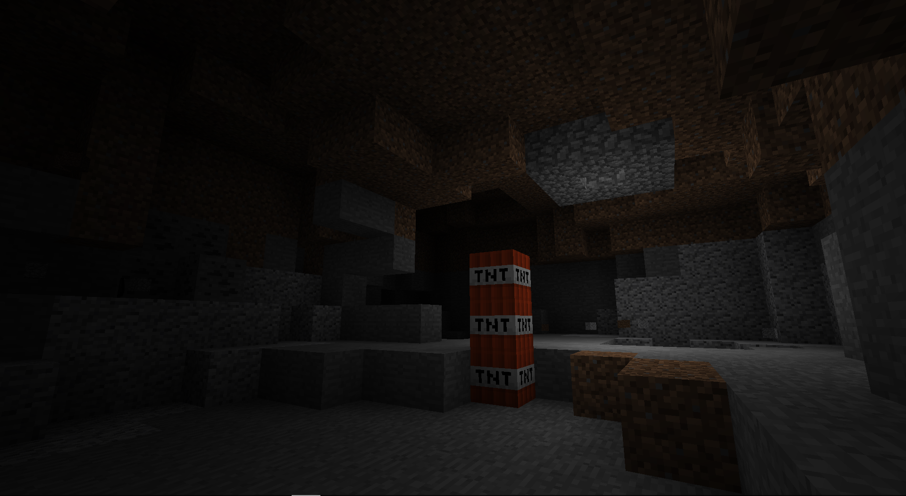
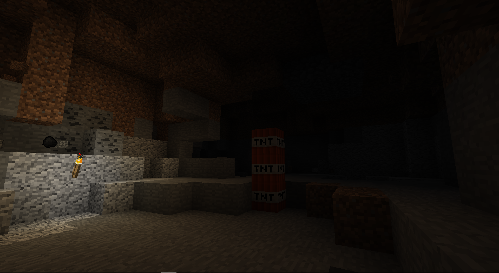

# Chunk

* 时间：2020-8-1
* 类别：地形生成
* 类：net.minecraft.world.chunk.Chunk

## 简介

Chunk是World生成的最小单位，一个World由无数个Chunk组成，而一个Chunk由16个Section垂直排列而成，而一个Section由16×16×16个Block组成。

Chunk.java类是定义Chunk的类。

## 属性

Chunk.java类有以下属性：

```java
public static final ExtendedBlockStorage NULL_BLOCK_STORAGE = null;
private final ExtendedBlockStorage[] storageArrays;
private final byte[] blockBiomeArray;
private final int[] precipitationHeightMap;
private final boolean[] updateSkylightColumns;
private boolean loaded;
private final World world;
private final int[] heightMap;
public final int x;
public final int z;
private boolean isGapLightingUpdated;
private final Map<BlockPos, TileEntity> tileEntities;
private final ClassInheritanceMultiMap<Entity>[] entityLists;
private boolean isTerrainPopulated;
private boolean isLightPopulated;
private boolean ticked;
private boolean dirty;
private boolean hasEntities;
private long lastSaveTime;
private int heightMapMinimum;
private long inhabitedTime;
private int queuedLightChecks;
private final ConcurrentLinkedQueue<BlockPos> tileEntityPosQueue;
public boolean unloadQueued;
```

我们一个个来看，在看某一个类时候，按照我们的阅读原则，我们应当关系一个属性的两个东西：

* 对象所属的父类
* 属性的数据结构

具体的细节请看[阅读源码八原则](./%E9%98%85%E8%AF%BB%E6%BA%90%E7%A0%81%E5%85%AB%E5%8E%9F%E5%88%99#%E5%85%88%E7%9C%8B%E5%B1%9E%E6%80%A7%E5%90%8E%E7%9C%8B%E6%96%B9%E6%B3%95)。



* NULL\_BLOCK\_STORAGE
  * 父类：ExtendedBlockStorage，这个父类是描述一个Section的类
  * 数据结构：普通变量
  * 含义：是一个空Section，注意，不是充满空气的Section，而是没有保存的Section，也就是Section对象是空的
  * 用途：通过判断一个Section对象与它是否相等来判断它是不是空Section
* storageArrays
  * 父类：ExtendedBlockStorage，这个父类是描述一个Section的类
  * 数据结构：16长度的一维数组
  * 含义：储存本Chunk中所有16个Section的数组
  * 用途：保存一个Chunk的所有Block
* blockBiomeArray
  * 父类：Byte
  * 数据结构：256长度的一维数组
  * 含义：本Chunk中保存的256（16×16）列所属的生物群系id
  * 用途：保存一个Chunk的所有生物群系id
* precipitationHeightMap
  * 父类：Integer
  * 数据结构：256长度的一维数组
  * 含义：本Chunk中保存的256（16×16）列中的降水高度数据，下雨时雨滴会在这个高度停下并在这个高度的下表面产生蓝色的粒子特效
  * 用途：指导降水粒子停止运动，指导降水碰撞粒子特效的产生
* updateSkylightColumns
  * 父类：Boolean
  * 数据结构：256长度的一维数组
  * 含义：本Chunk中保存的256（16×16）列是否要更新天光（全局光照）的标志位
  * 用途：指导OpenGL更新Chunk列的天光渲染
* tileEntities
  * 父类：&lt;BlockPos, TileEntity&gt;
  * 数据结构：Map&lt;BlockPos, TileEntity&gt;
  * 含义：平铺实体，比如说宝箱
  * 用途：储存Chunk中的平铺实体
* entityLists
  * 父类：Entity
  * 数据结构：16长度的ClassInheritanceMultiMap数组
  * 含义：实体列表，比如说一些mob（怪物）
  * 用途：储存Chunk中的实体
* world
  * 父类：World
  * 数据结构：普通变量
  * 含义：标识本Chunk所在的世界，世界有很多，有Overworld（主世界），end（末地）
  * 用途：从主世界获得一些光照数据，执行一些渲染动作之类的
* heightMap
  * 父类：Integer
  * 数据结构：256长度的一维数组
  * 含义：本Chunk中保存的256（16×16）列的高度，也就是最高的非空气方块的y坐标
  * 用途：涉及一些光线的计算、降水高度的判定



* isGapLightingUpdated
  * 父类：Boolean
  * 数据结构：普通变量
  * 含义：暂时不清楚
  * 用途：暂时不清楚
* isTerrainPopulated
  * 父类：Boolean
  * 数据结构：普通变量
  * 含义：暂时不清楚
  * 用途：暂时不清楚
* isLightPopulated
  * 父类：Boolean
  * 数据结构：普通变量
  * 含义：暂时不清楚
  * 用途：暂时不清楚
* ticked
  * 父类：Boolean
  * 数据结构：普通变量
  * 含义：暂时不清楚
  * 用途：暂时不清楚
* dirty
  * 父类：Boolean
  * 数据结构：普通变量
  * 含义：Chunk是否是脏的，是否需要更新
  * 用途：指导OpenGL对Chunk进行更新
* hasEntities
  * 父类：Boolean
  * 数据结构：普通变量
  * 含义：标识本Chunk中是否有实体
  * 用途：决定是否要在每一个ticked中保存
* loaded
  * 父类：Boolean
  * 数据结构：普通变量
  * 含义：标识本Chunk是否被加载的标志位，为了运行效率，Minecraft并不会同时加载地图中所有的Chunk
  * 用途：指导OpenGL在适当的时候加载Chunk
* unloadQueued
  * 父类：Boolean
  * 数据结构：普通变量
  * 含义：标识本Chunk是否在卸载队列中
  * 用途：卸载Chunk时作为判断依据



* x
  * 父类：Integer
  * 数据结构：普通变量
  * 含义：本Chunk在所处世界的x坐标
  * 用途：用于定位一个Chunk
* y
  * 父类：Integer
  * 数据结构：普通变量
  * 含义：本Chunk在所处世界的y坐标
  * 用途：用于定位一个Chunk



* lastSaveTime
  * 父类：Long
  * 数据结构：普通变量
  * 含义：保存本Chunk上一次保存的时间，保存世界是以游戏内的时间为标准的
  * 用途：当判断是否需要保存时，需要作为判断依据
* heightMapMinimum
  * 父类：Integer
  * 数据结构：普通变量
  * 含义：heightMap保存的256列的高度数据中，最低的值
  * 用途：在World类中的getChunksLowestHorizon函数中被调用，用于获取阳光直接到达的块的最低高度，或许与太阳落山/升起时的光线计算有关
* inhabitedTime
  * 父类：Long
  * 数据结构：普通变量
  * 含义：有人居住的时间，本质上是玩家在这个Chunk停留的ticked数
  * 用途：可能决定了怪生成的概率之类的东西
* queuedLightChecks;
  * 父类：Integer
  * 数据结构：普通变量
  * 含义：当前游戏循环中需要检查光线的方块的数量
  * 用途：用于更快地更新Chunk方块，具体的过程暂时未知
* tileEntityPosQueue;
  * 父类：BlockPos
  * 数据结构：ConcurrentLinkedQueue
  * 含义：以Queue方式创建实体时，排队等待的实体
  * 用途：保存本Chunk中要被创建的实体



## 方法



### get方法

```java
public Biome getBiome(BlockPos pos, BiomeProvider provider)
public byte[] getBiomeArray()
public int getBlockLightOpacity(BlockPos pos)
private int getBlockLightOpacity(int x, int y, int z)
public IBlockState getBlockState(final int x, final int y, final int z)
public IBlockState getBlockState(BlockPos pos)
public ExtendedBlockStorage[] getBlockStorageArray()
public <T extends Entity> void getEntitiesOfTypeWithinAABB(Class <? extends T > entityClass, AxisAlignedBB aabb, List<T> listToFill, Predicate <? super T > filter)
public void getEntitiesWithinAABBForEntity(@Nullable Entity entityIn, AxisAlignedBB aabb, List<Entity> listToFill, Predicate <? super Entity > filter)
public ClassInheritanceMultiMap<Entity>[] getEntityLists()
public int getHeightValue(int x, int z)
public int getHeight(BlockPos pos)
public int[] getHeightMap()
public long getInhabitedTime()
private ExtendedBlockStorage getLastExtendedBlockStorage()
public int getLightFor(EnumSkyBlock type, BlockPos pos)
public int getLightSubtracted(BlockPos pos, int amount)
public ChunkPos getPos()
public BlockPos getPrecipitationHeight(BlockPos pos)
public Random getRandomWithSeed(long seed)
public TileEntity getTileEntity(BlockPos pos, Chunk.EnumCreateEntityType createType)
public Map<BlockPos, TileEntity> getTileEntityMap()
public int getTopFilledSegment()
public World getWorld()
```

#### **getBiome**

```java
/**
* 取本Chunk中的某一个方块上的生物，如果无效，就返回BiomeProvider中的生物
* @param pos 本Chunk中的某一个方块的坐标对象
* @param provider 如果获取失败，应当放回的默认生物值
* @return 从Chunk获得的生物对象
*/
public Biome getBiome(BlockPos pos, BiomeProvider provider)
{
    int i = pos.getX() & 15; //获取方块的x坐标，与上15，使之在一个chunk内
    int j = pos.getZ() & 15; //获取方块的z坐标，与上15，使之在一个chunk内
    int k = this.blockBiomeArray[j << 4 | i] & 255; //获取一个点的生物群系id
​
    if (k == 255) //
    {
        Biome biome = provider.getBiome(pos, Biomes.PLAINS);  //从坐标里获得生物群系，默认群系为平原
        k = Biome.getIdForBiome(biome); //获得生物群系id
        this.blockBiomeArray[j << 4 | i] = (byte)(k & 255); //重新赋值生物群系id
    }
​
    Biome biome1 = Biome.getBiome(k); //获得生物群系
    return biome1 == null ? Biomes.PLAINS : biome1; //返回生物群系，如果是空，返回默认的平原
}
```

首先通过`pos`对象中获得方块的x轴和z轴坐标，`&15`是因为传进来的位置是全地图的坐标，而我们是通过某个Chunk获取的，所以x轴和z轴的坐标不能超过15，所以要这么做。获得x轴和z轴坐标后，通过`j << 4 | i`来获得这个方块在底面的序号，因为一个Chunk的16×16的列的生物id数据是存放在一个256长度的数组里的，所以要把二维的坐标转化为一维的序号。通过`blockBiomeArray`这个数组，获得了传入方块所在列的生物群系id。

在Chunk的构造函数中，初始化`blockBiomeArray`数组的时候，赋的初值就是`(byte)-1`，而上面为了获得生物群系id的时候，通过了`& 255`来转化为int类型了，-1结果这个处理后，也就是：

```java
(byte) -1 & 255
```

结果是255，所以如果`k`的值是255的话，说明生物群系id只结果初始化，没有有意义的值，所以不能直接返回Chunk提供的生物群系，所以需要从`BiomeProvider`对象中获得生物群系。

先从provider中通过getBiome函数传入方块位置对象pos，同时传入一个默认生物群系：平原，出现问题无法获得时，返回平原生物群系，获得生物群系对象后通过`getIdForBiome`函数转化为生物群系id，再传入`blockBiomeArray`数组进行更新，这样就能获得准确的生物群系对象。

更新完准确的生物群系id后，就可以正常获取了，首先通过id得到生物群系对象，再返回，当对象是空的时候，返回默认的生物群系：平原。

#### **getBiomeArray**

```java
/**
 * Returns an array containing a 16x16 mapping on the X/Z of block positions in this Chunk to biome IDs.
 * 返回Chunk中保存的16*16列的生物群系id数组
 * @return
 */
public byte[] getBiomeArray()
{
    return this.blockBiomeArray;
}
```

其实就是一个普通的get函数，没什么好讲的。

#### **getBlockLightOpacity**

```java
/**
 * 返回特定坐标的方块的不透明度
 * @param pos 方块坐标对象
 * @return 方块不透明度
*/
public int getBlockLightOpacity(BlockPos pos)
{
    return this.getBlockState(pos).getLightOpacity(); //通过位置获得所在方块的方块状态对象，再从这里获得方块不透明度
}
```

方块光线不透明度封装在方块状态类里，而方块状态对象通过本类中`getBlockState`函数来获取。

#### **getBlockLightOpacity**

```java
/**
 * 返回特定坐标的方块的不透明度
 * @param x x坐标值
 * @param y y坐标值
 * @param z z坐标值
 * @return 方块不透明度
*/
private int getBlockLightOpacity(int x, int y, int z)
{
    return this.getBlockState(x, y, z).getLightOpacity();
}
```

与上面的函数类似，只不过传入方块的位置参数不同，上一个是传入封装好的位置对象，这一个是直接传入方块的三维坐标。

#### **getBlockState**

```java
/**
 * 返回地图中特定坐标的方块对象
 * @param x x坐标值
 * @param y y坐标值
 * @param z z坐标值
 * @return IBlockState对象
*/
public IBlockState getBlockState(final int x, final int y, final int z)
{
    if (this.world.getWorldType() == WorldType.DEBUG_ALL_BLOCK_STATES) //如果世界的类型是调试模式
    {
        IBlockState iblockstate = null;
​
        if (y == 60) //debug模式中的障碍层
        {
            iblockstate = Blocks.BARRIER.getDefaultState(); //这一层全是障碍方块，直接返回障碍方块
        }
​
        if (y == 70) //debug的展示层
        {
            iblockstate = ChunkGeneratorDebug.getBlockStateFor(x, z);  //从debug模式获取展示的方块
        }
​
        return iblockstate == null ? Blocks.AIR.getDefaultState() : iblockstate; //空方块以空气方块填充
    }
    else //如果不是debug模式
    {
        try
        {   //如果在基岩上面而且方块所在section的id小于本区块的section的数目，也就是16
            if (y >= 0 && y >> 4 < this.storageArrays.length) 
            {
                ExtendedBlockStorage extendedblockstorage = this.storageArrays[y >> 4]; //获取方块所在section
​
                if (extendedblockstorage != NULL_BLOCK_STORAGE)
                {
                    return extendedblockstorage.get(x & 15, y & 15, z & 15); //获取坐标所指向的方块对象
                }
            }
​
            return Blocks.AIR.getDefaultState(); //如果找不到，返回默认值空气
        }
        catch (Throwable throwable)
        {
            CrashReport crashreport = CrashReport.makeCrashReport(throwable, "Getting block state");
            CrashReportCategory crashreportcategory = crashreport.makeCategory("Block being got");
            crashreportcategory.addDetail("Location", new ICrashReportDetail<String>()
            {
                public String call() throws Exception
                {
                    return CrashReportCategory.getCoordinateInfo(x, y, z);
                 }
            });
            throw new ReportedException(crashreport);
        }
    }
}
```

如果这个世界是debug模式的话，执行下面的代码，所谓debug模式，就是把本版本的所有物品平铺在一层上，供开发者调试，它只有两层，一层是y=60的障碍层，是为了阻止玩家往下移动，还有一层是y=70的物品展示层，平铺着所有的物品，每个物品与其它物品之间有空气隔离。debug模式实图如下：



```java
IBlockState iblockstate = null;

if (y == 60) //debug模式中的障碍层
{
    iblockstate = Blocks.BARRIER.getDefaultState(); //这一层全是障碍方块，直接返回障碍方块
}

if (y == 70) //debug的展示层
{
    iblockstate = ChunkGeneratorDebug.getBlockStateFor(x, z);  //从debug模式获取展示的方块
}

return iblockstate == null ? Blocks.AIR.getDefaultState() : iblockstate; //空方块以空气方块填充
```

当传入的方块的y轴坐标等于60时，说明取得是障碍层，那就直接把障碍方块的默认的状态赋值给方块状态对象。当y轴坐标等于70时，说明是展示层，那就使用`ChunkGeneratorDebug`类中的`getBlockStateFor`方法获得对应位置的方块对象。最后还得处理好空指针的问题，当传入的y轴既不是60也不是70的话，iblockstate是空的，就应该返回空气方块的默认状态。

如果不是debug模式的话，执行下面的代码：

```java
try
{   //如果在基岩上面而且方块所在section的id小于本区块的section的数目，也就是16
    if (y >= 0 && y >> 4 < this.storageArrays.length) 
    {
        ExtendedBlockStorage extendedblockstorage = this.storageArrays[y >> 4]; //获取方块所在section

        if (extendedblockstorage != NULL_BLOCK_STORAGE)
        {
            return extendedblockstorage.get(x & 15, y & 15, z & 15); //获取坐标所指向的方块对象
        }
    }
    return Blocks.AIR.getDefaultState(); //如果找不到，返回默认值空气
}
catch (Throwable throwable)
{
    CrashReport crashreport = CrashReport.makeCrashReport(throwable, "Getting block state");
    CrashReportCategory crashreportcategory = crashreport.makeCategory("Block being got");
    crashreportcategory.addDetail("Location", new ICrashReportDetail<String>()
    {
    	public String call() throws Exception
        {
        	return CrashReportCategory.getCoordinateInfo(x, y, z);
        }
    });
    throw new ReportedException(crashreport);
}
```

首先来个判断，如果方块的y轴坐标大于等于0且y轴坐标所在Section的id在范围之内，也就是方块的位置不高也不低，处于正常的位置时，先从`storageArrays`获得方块所在的Section，如果Section对象不为空的话，通过`ExtendedBlockStorage`类中的get方法获取方块状态对象，如果不满足条件，就返回空气。

#### **getBlockState**

```java
/**
 * 以BlockPos方式传入方块坐标
 * @param pos 方块坐标对象
 * @return IBlockState方块状态对象
*/
public IBlockState getBlockState(BlockPos pos)
{
    return this.getBlockState(pos.getX(), pos.getY(), pos.getZ());
}
```

再次封装函数`public IBlockState getBlockState(final int x, final int y, final int z)`，只传入封装方块位置的BlockPso对象。

#### **getBlockStorageArray**

```java
/**
 * Returns the ExtendedBlockStorage array for this Chunk.
 * 从chunk返回section列表
*/
public ExtendedBlockStorage[] getBlockStorageArray()
{
    return this.storageArrays;
}
```

返回本Chunk保存的Section数组。没什么好讲的。

#### **getEntitiesOfTypeWithinAABB**

```java
/**
 * @param entityClass 
 * @param aabb
 * @param listToFill
 * @param filter
 * @param <T>
*/
public <T extends Entity> void getEntitiesOfTypeWithinAABB(Class <? extends T > entityClass, AxisAlignedBB aabb, List<T> listToFill, Predicate <? super T > filter)
{
    int i = MathHelper.floor((aabb.minY - 2.0D) / 16.0D);
    int j = MathHelper.floor((aabb.maxY + 2.0D) / 16.0D);
    i = MathHelper.clamp(i, 0, this.entityLists.length - 1);
    j = MathHelper.clamp(j, 0, this.entityLists.length - 1);

    for (int k = i; k <= j; ++k)
    {
        for (T t : this.entityLists[k].getByClass(entityClass))
        {
            //如果选到的区域与aabb重叠且通过了过滤
            if (t.getEntityBoundingBox().intersects(aabb) && (filter == null || filter.apply(t))) 
            {
                listToFill.add(t); //就把它加入到列表中
            }
        }
    }
}
```

还未知。

#### **getEntitiesWithinAABBForEntity**

```java
/**
 * Fills the given list of all entities that intersect within the given bounding box that aren't the passed entity.
 * 填充给定边界框内相交但不是传递实体的所有实体的给定列表。
 * @param entityIn   
 * @param aabb
 * @param listToFill
 * @param filter
*/
public void getEntitiesWithinAABBForEntity(@Nullable Entity entityIn, AxisAlignedBB aabb, List<Entity> listToFill, Predicate <? super Entity > filter)
{
    int i = MathHelper.floor((aabb.minY - 2.0D) / 16.0D);
    int j = MathHelper.floor((aabb.maxY + 2.0D) / 16.0D);
    i = MathHelper.clamp(i, 0, this.entityLists.length - 1);
    j = MathHelper.clamp(j, 0, this.entityLists.length - 1);

    for (int k = i; k <= j; ++k)
    {
        if (!this.entityLists[k].isEmpty())
        {
            for (Entity entity : this.entityLists[k])
            {
                if (entity.getEntityBoundingBox().intersects(aabb) && entity != entityIn)
                {
                    if (filter == null || filter.apply(entity))
                    {
                        listToFill.add(entity);
                    }

                    Entity[] aentity = entity.getParts();

                    if (aentity != null)
                    {
                        for (Entity entity1 : aentity)
                        {
                            if (entity1 != entityIn && entity1.getEntityBoundingBox().intersects(aabb) && (filter == null || filter.apply(entity1)))
                            {
                                listToFill.add(entity1);
                            }
                        }
                    }
                }
            }
        }
    }
}
```

未知。

#### **getEntityLists**

```java
/**
 * 返回实体列表map
 * @return 本Chunk中的实体列表map
*/
public ClassInheritanceMultiMap<Entity>[] getEntityLists()
{
    return this.entityLists;
}
```

返回本Chunk中的实体列表map，没什么好讲的

#### **getHeightValue**

```java
/**
 * Returns the value in the height map at this x, z coordinate in the chunk
 * 获取x，z的地形高度
*/
public int getHeightValue(int x, int z)
{
    return this.heightMap[z << 4 | x]; //把x,z转化为0-255的值，也就是说找到一个方块的坐标，转化为它的序号
}
```

从heightMap中获取某一个列的高度，传入x轴和z轴的坐标，把x和z轴坐标通过`z << 4 | x`转化为序号，在从heightMap检索列高度。

#### **getHeight**

```java
/**
 * 从方块坐标获得方块高度，由于方块坐标不一定在0-15之间，所以需要取&来保证
 * @param pos 方块坐标
 * @return 高度
*/
public int getHeight(BlockPos pos)
{
    return this.getHeightValue(pos.getX() & 15, pos.getZ() & 15);
}
```

封装上面的函数，传入封装好的方块的位置对象，返回方块所在列的高度。

#### **getHeightMap**

```java
/**
 * 返回本Chunk中16*16方块的列的高度数组
 * @return 256长度的列高度数组
*/
public int[] getHeightMap()
{
    return this.heightMap;
}
```

返回本Chunk中16\*16方块的列的高度数组heightMap，没啥可说的。

#### **getInhabitedTime**

```java
/**
 * 返回玩家在本Chunk中呆的时间
 * @return 玩家待的时间
*/
public long getInhabitedTime()
{
    return this.inhabitedTime;
}
```

返回玩家在本Chunk中呆的时间，没什么好讲的。

#### **getLastExtendedBlockStorage**

```java
/**
 * 获得最上面的非空section
 * @return section对象
*/
@Nullable
private ExtendedBlockStorage getLastExtendedBlockStorage()
{
    for (int i = this.storageArrays.length - 1; i >= 0; --i)  //从上到下遍历chunk里的section
    {
        if (this.storageArrays[i] != NULL_BLOCK_STORAGE) //如果此section非空
        {
            return this.storageArrays[i]; //就返回该section
        }
    }

    return null; //如果没找到，就返回空
}
```

要获得最上面的非空section，肯定得从上面开始检查，所以有一个从上往下的遍历的for循环，从`storageArrays`中遍历`ExtendedBlockStorage`对象，如果section对象不是空的，就返回该section对象，那就是最上面的非空section。

#### **getLightFor**

```java
/**
 * 根据方块类型返回亮度
 * 如果是空的，返回默认值
 * 如果是天空，返回全局光照
 * 如果是方块，返回局部光照
 * @param type 方块类型
 * @param pos 坐标对象
 * @return 亮度值
*/
public int getLightFor(EnumSkyBlock type, BlockPos pos)
{
    int i = pos.getX() & 15; //取 0-15之间，也就是一个section底面以内
    int j = pos.getY();
    int k = pos.getZ() & 15; //取 0-15之间，也就是一个section底面以内
    ExtendedBlockStorage extendedblockstorage = this.storageArrays[j >> 4]; //得到所在section

    if (extendedblockstorage == NULL_BLOCK_STORAGE)
    {
        //如果能看见天空，就返回默认的光亮值，如果看不见，就返回0
        return this.canSeeSky(pos) ? type.defaultLightValue : 0; 
    }
    else if (type == EnumSkyBlock.SKY)
    {
        //从section获得sky light
        return !this.world.provider.hasSkyLight() ? 0 : extendedblockstorage.getSkyLight(i, j & 15, k);
    }
    else
    {
        return type == EnumSkyBlock.BLOCK ? extendedblockstorage.getBlockLight(i, j & 15, k) : type.defaultLightValue;//如果是一个block，就从block处返回局部光照，否则返回默认的光照
    }
}
```

首先也是从方块位置对象中获得方块的x轴、y轴、z轴坐标值，同时把x轴和y轴`&15`，使之保持在0-15之间，也就是处于一个Chunk中，然后通过  y &gt;&gt; 4 来得出方块所在的section的id，再从storageArrays中索引section对象，如果section是非空的，且该方块的位置能看见天空，就返回默认的天光光线强度，如果看不见，就返回0，也就是没有天光。

如果方块所处的位置是天空的话，如果含有天光，就通过getSkyLight函数获得天光强度，如果没有，就返回0，如果都不是，也就是普通的section，且该位置有方块，且通过getBlockLight返回方块光线强度，如果不是方块，就返回默认的光线强度。

#### getLightSubtracted

```java
/**
 * 用来计算天光从洞口照入山洞中有局部光照的方块的渲染光照
 * @param pos 方块的位置对象
 * @param amount 天光到达方块的衰减
 * @return 方块应该显示的亮度
 */
public int getLightSubtracted(BlockPos pos, int amount)
{
    int i = pos.getX() & 15; //获得x轴坐标并定位到一个chunk范围内
    int j = pos.getY(); //获得y轴坐标
    int k = pos.getZ() & 15; //获得轴坐标并定位到一个chunk范围内
    ExtendedBlockStorage extendedblockstorage = this.storageArrays[j >> 4]; //获得section的id后从storageArrays中获得方块所在section对象

    if (extendedblockstorage == NULL_BLOCK_STORAGE) //如果section为空，就从worlc里获取skylight
    {
        //有sky light且够减的话就返回减去的值，如果不是的话返回0
        return this.world.provider.hasSkyLight() && amount < EnumSkyBlock.SKY.defaultLightValue ? EnumSkyBlock.SKY.defaultLightValue - amount : 0;
    }
    else //如果有section
    {
        int l = !this.world.provider.hasSkyLight() ? 0 : extendedblockstorage.getSkyLight(i, j & 15, k); //通过section获得全局光照
        l = l - amount;//减去衰减值
        int i1 = extendedblockstorage.getBlockLight(i, j & 15, k); //通过block获得局部光照

        if (i1 > l) //如果局部光照比全局光照还大
        {
            l = i1; //就取局部光照
        }

        return l; //总之就是选择全局光照折损之后的与局部光照之间的最大值
    }
}
```

具体的看注释，注释已经写得很详细了，我主要说一下这个函数大概的用处。首先得说一下游戏里的两种光照：

* 全局光照：一般由一个位于场景上方的大灯模拟太阳/月亮，在Minecraft就是阳光和月光，它会受天气、时间的影响，在代码里叫SkyLight，天光。
* 局部光照：一般是物体周围其它发光物品产生的，在Minecraft里火把的亮光就是局部光照，代码里叫BlockLight

下面是全局光照+局部光照/只有全局光照/只有局部光照的场景对比：







可以明显地看到，这三个场景的光线是完全不同的，在游戏中，时常要处理这种既有全局光照又有局部光照的场景，程序需要根据照射到方块的局部光照强度和全局光照强度，再加上全局光照的衰减，算出应该在方块上渲染的光线强度。

程序的第9-12行不再赘述，取得方块所在section对象，如果对象为空，说明方块是暴露在全局光照下的，那就没有局部光照什么事了，直接把全局光照减去其衰减值，当然不能把光照强度减成负数了，要成负数了就改成0。

如果不是空，说明方块处于类似于上图所示的环境中，既有全局光照又有局部光照，那我们获取全局光照后减去衰减值，这是全局光照在方块上的情况，把它与局部光照对比，取其最大值，然后返回，这就是这个函数的作用，算出一个综合的光线强度。

#### getLowestHeight

```java
/**
 * 返回heightMap中最小的值
 * @return heightMap中最小的值 
 */
public int getLowestHeight()
{
    return this.heightMapMinimum;
}
```

没啥好讲的，返回`heightMap`数组中最小的值

#### getPos

```java
/**
 * Gets a {@link ChunkPos} representing the x and z coordinates of this chunk.
 * 返回一个封装好本Chunk的x轴和z轴坐标的ChunkPos对象
 */
public ChunkPos getPos()
{
    return new ChunkPos(this.x, this.z);
}
```

返回一个封装好本Chunk的x轴和z轴坐标的ChunkPos对象

#### getPrecipitationHeight

```java
/**
 * 重新计算某个方块所在列的降水高度，方便给水滴动作一点的指示
 * @param pos 封装好方块坐标的对象
 * @return 这个方块所在列的降水应该停留的方块位置
 */
public BlockPos getPrecipitationHeight(BlockPos pos)
{
    int i = pos.getX() & 15;
    int j = pos.getZ() & 15;
    int k = i | j << 4; //根据x，z轴获得在一个chunk平面的序号
    ////根据方块的x，z和降水高度获得接收到降水的区块的位置
    BlockPos blockpos = new BlockPos(pos.getX(), this.precipitationHeightMap[k], pos.getZ()); 

    if (blockpos.getY() == -999) //降水高度只被初始化了，没有被计算过，降水高度是无效的
    {
        int l = this.getTopFilledSegment() + 15; //取最上面非空section的最上面一层方块
        blockpos = new BlockPos(pos.getX(), l, pos.getZ()); //获取该方块的位置对象
        int i1 = -1; //定义初始降水高度

        while (blockpos.getY() > 0 && i1 == -1) //如果方块存在且刚刚开始
        {
            IBlockState iblockstate = this.getBlockState(blockpos); //获得方块
            Material material = iblockstate.getMaterial(); //获得材质

            if (!material.blocksMovement() && !material.isLiquid()) //如果方块不是固体且方块不是液体
            {
                blockpos = blockpos.down(); //那就是空的呗，位置下降一格，大概是模拟雨滴下降的动作吧
            }
            else //如果是固体或者是液体，雨滴收到了遮挡
            {
                i1 = blockpos.getY() + 1; //降水高度应该是接触方块的上面一格
            }
        }
        //如果你想获得0层以及0层以下的降水高度，那么降水高度是-1
        this.precipitationHeightMap[k] = i1; //把降水高度赋值给列表
    }

    return new BlockPos(pos.getX(), this.precipitationHeightMap[k], pos.getZ()); //返回封装好的位置对象
}
```

我们看这个函数，从它的名字来看，这个函数的功能是获得降水高度，从返回值的类型来看，它需要得到的是一个封装了方块位置的BlockPos类的对象。

前面我们大概能理解它的思路，先是从输入的BlockPos对象里获得所要求降水高度的方块的x轴和z轴，`&`上15的目的主要是让坐标值处于0-15之间，毕竟我们是在一个chunk里进行操作的，得到x轴和z轴的坐标后，使用`i | j << 4`获得该方块在它所在平面的序号，这个序号从0-255，然后根据这个序号获得方块所在列（垂直的一列）的降水高度，这个是一个y坐标值，其含义是该列接到的降水的方块的y坐标值，有了它后加上x轴和z轴坐标，新建一个BlockPos对象来代表这个列的降水所在方块的位置。

然后判断，如果这个降水位置的y坐标是-999的时候，说明从数组`precipitationHeightMap`获得的降水处于初始化状态，-999是一个无意义的初始化值，只作判定用，我们可以使用IDEA的`Find Usage`来查看这个变量的使用的地方：


我们发现，只有上面这个函数的第1262行有一个给`precipitationHeightMap`赋非-999值的地方，也就是说如果碰到有降水高度是-999的情况，就说明还没有执行这个函数。

我们需要更新它的值，我们先获得此方块所在section的最上面一层方块的y坐标值，再用这个y坐标值替换原来无意义的y坐标值-999，给blockpos赋一个新的值，接下来，我们定义一个虚空世界的降水高度值，这个值为-1，所有处于虚空的方块的降水高度都是这个值，也就是说，虚空的降水最多只能下到-1层。什么，你不相信？？我们来分析分析。

我们假设我们现在要利用这个函数获取一个处在虚空的方块的降水高度，以此为依据，控制降水到什么地方停下，虚空方块的坐标的特点是，其y坐标为负数，那我们就可以随便找一个虚空世界的方块坐标，比如说是`(131,-22,12)`，把它封装成一个BlockPos对象后传入这个函数，并获取返回值，我们看看会发生什么。

前面的几行没有什么疑问，获取坐标值，获得本列降水下一个方块的位置对象，由于我们没有执行过这个函数，所以下面的`if (blockpos.getY() == -999)`这个判断我们是符合的。

首先我们获得最上面的非空section的最顶层y坐标，在生成对应的方块位置对象，然后我们定义了一个虚空降水高度-1，然后我们进入了一个while循环，这个while循环的进入条件是`blockpos.getY() > 0 && i1 == -1`我们显然不符合第一条，所以我们不进入这个while循环，然后我们就直接就把`i1`也就是-1的值赋值给`precipitationHeightMap`数组，当成是这个列的降水高度，最后封装成BlockPos对象返回出来，所以虚空（包括基岩）的降水高度都是-1格，也就是基岩下面的一格。

那不是虚空也不是基岩的方块的降水高度是然后计算的呢？我们就得看while循环内部的东西了，我们知道，非虚空和基岩的y坐标值肯定是大于0的，同时如果在第一次while循环中，i1的值还是-1没有变，所以while循环的进入条件是符合的，我们进入了while循环。

首先我们根据方块的坐标对象，获得了方块的状态对象，然后我们使用方块状态获得了方块的材质，然后我们判断了，如果方块的材质不能让人移动且不是液体的话，就执行`blockpos = blockpos.down();`就是把blockpos的y坐标值减1，把`指针`指向下一格方块，它的意思是，这个方块可以使雨滴透过，所以不可能是降水高度所在点，所以我们得往下找，等进入下一个循环，我们依旧这么判断，如果还是能使雨滴透过的方块，我们就继续找，知道我们遇到一个雨滴透不过的方块，我们就把这个方块的上一格的y轴坐标加1，赋值给i1，此时i1就是我们要找的降水高度，因为雨水在这个方块上面停住了。下面就是虚空下的降水的实物图，我们可以看到，虚空的降水停在了-1层。


i1被赋了非-1值，也就不满足while循环的条件，自然就退出了循环，退出循环后，就说明我们找到了真实的降水高度，也就是雨滴应该停止的地方，我们再把i1赋值给`precipitationHeightMap`,然后把这个雨滴停留的方块的位置封装成BlockPos对象返回就可以了。

那如何验证我们这套理论呢？Minecraft真的就这么运行的吗？我们可以把`i1 = blockpos.getY() + 1;`的+1去掉或者减去1，看看会发生什么，我们应当在一个蜘蛛网下方放一个玻璃方块，当我们保留+1的时候，当while循环从蜘蛛网遍历到玻璃方块时候，会运行这条语句，此时记录的雨滴停留方块应当在蜘蛛网的这一格上，也就是在玻璃方块和蜘蛛网交界的平面，会出现雨滴撞击的深蓝色粒子特效，如果我们去掉+1，那么雨滴的降水高度将会判定在玻璃方块的位置上，雨滴的碰撞效果也会在玻璃方块的底部产生，但是由于玻璃方块是透明的，我们依然可以看到这个粒子效果。减一同理，但是粒子效果会在最底层的玻璃方块的下表面产生，下图就是不加一和加一和减一的实际效果图。​  ​

我们可以看到，现实情况和我们预想的一样，当不加1的时候，游戏判定的降水高度是玻璃方块这一层，粒子特效也产生于第一个玻璃方块和第二个玻璃方块之间，也就是最左边这幅图所展示的情况，这种情况是不正常的，因为玻璃方块不透雨，雨滴不应该落在两个玻璃方块之间，如果加1，也就是正常情况，也就是中间这幅图的情况，降水判定在蜘蛛网和玻璃方块之间，碰撞产生的粒子效果也产生在玻璃方块和蜘蛛网之间。如果减1，那就是右边这幅图的情况，此时，降水判定在正常位置的下面两格，也就是最底层玻璃方块的下面表面。

#### getRandomWithSeed

```java
/**
 * 使用地图种子生成chunk的随机数
 * 随机数与输入的种子，区块的x，z有关
 * @param seed 地图种子
 * @return 随机数变量
 */
public Random getRandomWithSeed(long seed)
{
    return new Random(this.world.getSeed() + (long)(this.x * this.x * 4987142) + (long)(this.x * 5947611) + (long)(this.z * this.z) * 4392871L + (long)(this.z * 389711) ^ seed);
}
```

这个函数主要用于生成一个本Chunk所独有的随机对象，生成的随机数对象与传入的种子、地图的种子、Chunk的位置x,y,z轴坐标有关，目前所知道的用处是在化石生成上，具体的机制暂时不清楚，推测还与柏林噪声的初始随机数有关。

化石的生成被定义在了WorldGenFossils类中，会影响化石生成的高度。

#### getTileEntity

```java
/**
 * 从方块的位置上获得平铺实体，本质上是以给定的方式在一个位置上创建平铺实体
 * @param pos 需要获得的方块位置
 * @param createType 创建实体的类型，定义在本类中的EnumCreateEntityType枚举中
 * @return 平铺实体对象
 */
@Nullable
public TileEntity getTileEntity(BlockPos pos, Chunk.EnumCreateEntityType createType)
{
    TileEntity tileentity = this.tileEntities.get(pos);  //获得tile 实体

    if (tileentity == null) //如果实体是空，要创建
    {
        if (createType == Chunk.EnumCreateEntityType.IMMEDIATE)  //如果创建实体的类型是立即
        {
            tileentity = this.createNewTileEntity(pos); //新建实体
            this.world.setTileEntity(pos, tileentity); //设置实体
        }
        else if (createType == Chunk.EnumCreateEntityType.QUEUED) //如果创建实体的类型是排队
        {
            this.tileEntityPosQueue.add(pos); //把它的位置对象加入到队列中取
        }
    }
    else if (tileentity.isInvalid())  //如果不为空且是失效的
    {
        this.tileEntities.remove(pos); //去除实体
        return null; //返回空
    }

    return tileentity; //返回实体
}
```

其思路和getPrecipitationHeight函数类似，都是先从本Chunk中获得，如果获得的无效，就更新。Chunk里的平铺实体是存放在tileEntities里的，先通过它来获得平铺实体，如果平铺实体是空的，说明原来的平铺实体是无效的，需要更新。

如果是立刻创建的方式，我们就直接调用本Chunk中的createNewTileEntity函数来创建一个平铺实体，在把它加入到这个世界中。

如果是排队创建的方式，我们就把该位置加入到队列里，这个队列就是tileEntityPosQueue。

如果实体是存在的，但是无效了，那我们需要删除它，我们将它从保存平铺实体的tileEntities中删除，在返回一个null。

之后就正常发挥平铺实体，第30行只有两种情况可以运行到这里：

* 从Chunk中直接获得的平铺实体对象本身就是有效的
* 从Chunk中直接获得的平铺实体无效但是重新创建了新的平铺实体

#### getTileEntityMap

```java
/**
 * 返回保存平铺实体的map
 * @return Chunk中的保存平铺实体的map
 */
public Map<BlockPos, TileEntity> getTileEntityMap()
{
    return this.tileEntities;
}

```

#### getTopFilledSegment

```java
/**
 * Returns the topmost ExtendedBlockStorage instance for this Chunk that actually contains a block.
 * 返回此实际包含块的块的最顶层ExtendedBlockStorage实例。
 * 返回的是能代表它的y坐标
 */
public int getTopFilledSegment()
{
    ExtendedBlockStorage extendedblockstorage = this.getLastExtendedBlockStorage();
    return extendedblockstorage == null ? 0 : extendedblockstorage.getYLocation();
}
```

封装getLastExtendedBlockStorage函数，获得最上层非空section的y坐标。如果没有非空section，就返回0。

#### getWorld

```java
/**
 * 获得本Chunk所处的世界
 * @return 本Chunk所处世界对象
 */
public World getWorld()
{
    return this.world;
}
```

获得本Chunk所处的世界对象



### set方法

```java
public void setBiomeArray(byte[] biomeArray)
```

#### setBiomeArray

```java
/**
 * Accepts a 256-entry array that contains a 16x16 mapping on the X/Z plane of block positions in this Chunk to biome IDs.
 * 接受一个256项数组，该数组包含该块中块位置X/Z平面上的16x16映射到biome IDs。
 * 这里是chunk类中唯一一个可以写入blockBiomeArray的方法，构造方法只是初始化了变量
 */
public void setBiomeArray(byte[] biomeArray)
{
    if (this.blockBiomeArray.length != biomeArray.length)  //如果传入的数组长度不符合要求，就报错
    {
        LOGGER.warn("Could not set level chunk biomes, array length is {} instead of {}", Integer.valueOf(biomeArray.length), Integer.valueOf(this.blockBiomeArray.length));
    }
    else
    {
        System.arraycopy(biomeArray, 0, this.blockBiomeArray, 0, this.blockBiomeArray.length); //拷贝数组到blockBiomeArray
    }
}
```

本函数的作用是从外部设置本Chunk的生物群系数组，该数组里储存着256列的生物群系信息。首先得检查一下数组的长度是否符合要求，因为以后有一些函数中需要代入值来获得某一列的生物群系id，如果长度不够的话会导致小标越界的问题。

符合要求后，使用System.arraycopy函数进行复制。




